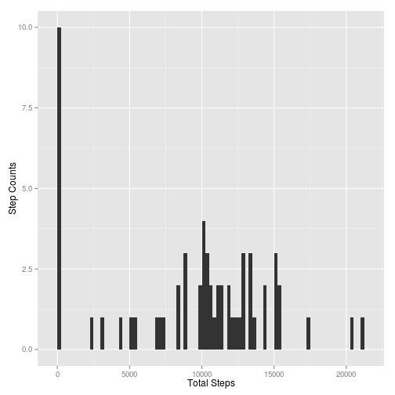
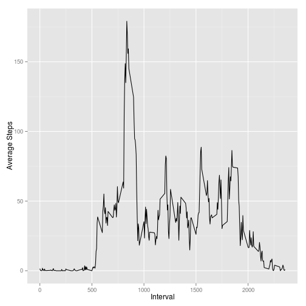
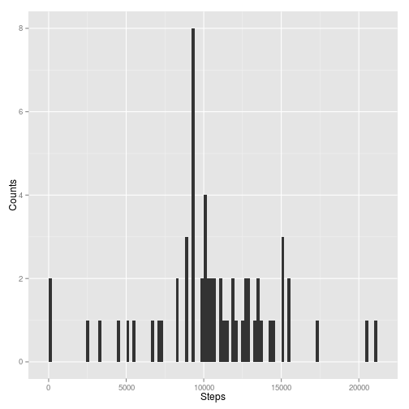
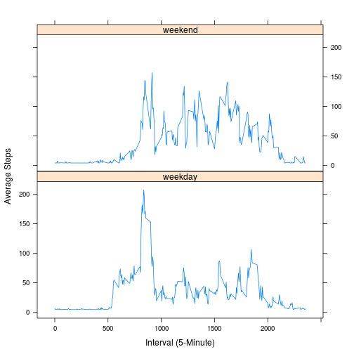

# Reproducible Research: Peer Assessment 1
## Loading and preprocessing the data
We first read the data into a variable

```r
activity <- read.csv("activity.csv", header=TRUE, na.strings="NA")

if( class(activity$date) != 'Date'){
  activity$date <- as.Date(activity$date)
}
#maintain the original data set
originalActivity <- activity
##transform the activity so that all NAs become 0s
activity[is.na(activity)] <- 0

#get the total steps for each day
dailySteps <- aggregate(activity$steps~activity$date, activity, sum)

#set the column names for our data
colnames(dailySteps) <- c("Date", "Total.Steps")
```

## What is mean total number of steps taken per day?
The histogram for total number of steps taken each day

```r
## Histogram
library(ggplot2)
#plot
qplot(Total.Steps, data=dailySteps, 
      ylab="Step Counts", xlab="Total Steps", binwidth=250)
```

 

```r
#Mean per day
dailyMeanSteps <- round(mean(dailySteps$Total.Steps), digits=0)

#Median
dailyMedian <- round(median(dailySteps$Total.Steps), digits=0)
```

The mean number of steps per day is 9354 and the median is 1.0395 &times; 10<sup>4</sup>.

## What is the average daily activity pattern?

```r
##aggregate steps per interval and format the column names
averageIntervalSteps <- aggregate(activity$steps~activity$interval, activity, mean)
colnames(averageIntervalSteps) <- c("Interval", "AverageSteps")
##plot
qplot(Interval, AverageSteps, data = averageIntervalSteps, 
      xlab = "Interval", ylab="Average Steps", geom="line")
```

 

```r
##return interval with maximum steps
intervalWithMaxSteps <- averageIntervalSteps[which.max(averageIntervalSteps$Average),1]
```

The 835 interval is one with maximum average number of steps across all days

## Imputing missing values

```r
#we are going to use the non transformed dataset
# extract rows without NAs (as T or F)
completeRows <- complete.cases(originalActivity)

#count the missing-value rows (completement of completeRows, T=0, F=1)
naRows <- sum(!completeRows)
```

There are 2304 rows with missing data in the original dataset.

### Strategy for imputting missing values
The missing values can be filled in using the average number of steps taken at each interval

### Strategy implementation

```r
# daily mean steps for the two months
#calculate the daily mean
dailyMeanSteps <- aggregate(activity$steps~activity$date, activity, mean)
colnames(dailyMeanSteps) <- c("Date", "MeanSteps")
overAllMean <- mean(dailyMeanSteps$MeanSteps)

#replacing all missing values
originalActivity[is.na(originalActivity)] <- overAllMean
#ploting the number of steps per day

#now calculate the sum total of steps for each dat in the two months
totalSteps <- aggregate(originalActivity$steps~originalActivity$date, originalActivity, sum)
colnames(totalSteps) <- c("dates","step")
##plot
qplot(totalSteps$step, data = totalSteps, 
      xlab = "Steps", ylab="Counts", binwidth=200)
```

 

```r
dailyMean <- round(mean(totalSteps[,2]), digits=0)
#median
dailyMedian <- round(median(totalSteps[,2]), digits=0)
```

After filling in the missing values the mean is 1.0581 &times; 10<sup>4</sup> and the median is 1.0395 &times; 10<sup>4</sup>.
The values especially the mean differs from the first estimate.
The mean changed because now the sum of mean has gone up and the number of observations has remained the same, 
this is the reason why the mean has increased.

## Are there differences in activity patterns between weekdays and weekends?
From the plots there appears to be some small differences, for example in the weekend days, the number of steps taken is rather
uniform for all the intervals, and this number has a lot of surges during weekdays.

```r
library(lattice)
#get days of the week and make their column a factor
originalActivity$date <- as.factor(weekdays(originalActivity$date))

#set the days as either weekend or weekday
originalActivity$date <- ifelse(originalActivity$date %in% c("Saturday", "Sunday"), "weekend","weekday")

#calculate the mean step for each interval for a day
avgIntSteps <- aggregate(originalActivity$steps~originalActivity$date+originalActivity$interval, originalActivity, mean)

#format column names
colnames(avgIntSteps) = c("date", "interval","avgSteps")

#plot
xyplot(avgSteps ~ interval | date, data = avgIntSteps, 
       type="l", xlab="Interval (5-Minute)", ylab="Average Steps", layout=c(1,2))
```

 
